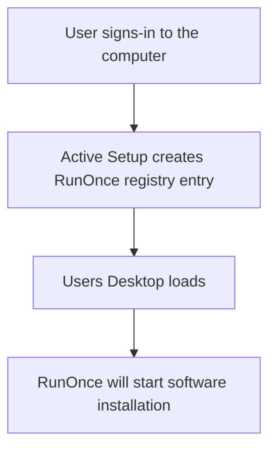

# Downloads and documentation
<b>Download links:</b> <br /> 
* [Brave](https://github.com/brave/brave-browser) <br />

<b>Steps from preparing computer for software installation:</b>
* Software installation file placed in C:\
* Active Setup registry key created

<b>Software installation flow using Active Setup and RunOnce:</b>


<b>Registry commands</b>
```powershell
ni "HKLM:\SOFTWARE\Microsoft\Active Setup\Installed Components\InstallBrave" | New-ItemProperty -Name "StubPath" -Value 'REG ADD "HKCU\Software\Microsoft\Windows\CurrentVersion\RunOnce" /v InstallBrave /t REG_SZ /d "C:\BraveBrowserStandaloneSilentSetup.exe"'
```

# Related videos
<b>Windows registry</b> <br />
[Windows Registry: Run and RunOnce](https://youtu.be/zgFzCq5uEPw) <br />
[Windows Registry: Active Setup](https://youtu.be/HrVJ7wdvfmo) <br />
<b>Creating MSI file</b> <br />
[WiX toolset 4 CLI: Create Brave Browser MSI installation file](https://youtu.be/zZyS3LLuy5Q)
