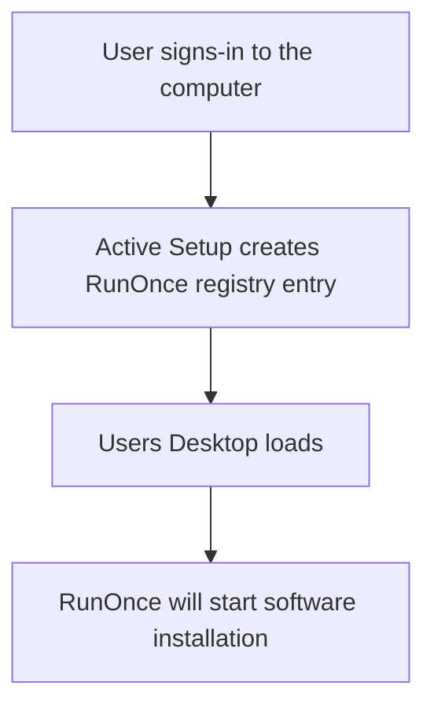

# Silent software installation
<b>Download links:</b> <br /> 
* [Ryver](https://ryver.com/downloads/) <br />

<b>Steps from preparing computer for software installation:</b>
* Software installation file placed in C:\
* Active Setup registry key created

<b>Software installation flow using Active Setup and RunOnce:</b>



<b>Registry commands</b>

```powershell
ni "HKLM:\SOFTWARE\Microsoft\Active Setup\Installed Components\InstallRyver" | New-ItemProperty -Name "StubPath" -Value 'REG ADD "HKCU\Software\Microsoft\Windows\CurrentVersion\RunOnce" /v InstallRyver /t REG_SZ /d "C:\RyverSetup-1.3.2-x64.exe -s"'
```

# Related videos
<b>Windows registry</b>

[Windows Registry: Run and RunOnce](https://youtu.be/zgFzCq5uEPw) <br />
[Windows Registry: Active Setup](https://youtu.be/HrVJ7wdvfmo) <br />

<b>Creating MSI file</b>

[WiX toolset 4 CLI: Create Ryver MSI installation file](https://youtu.be/xEidNdMOR5A)