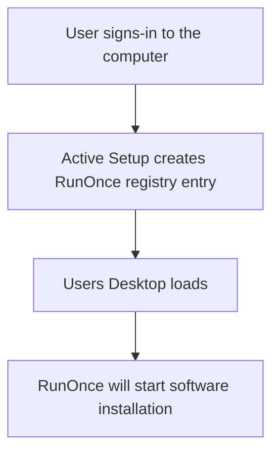

# Documentation and download
Download link: [Ryver](https://ryver.com/downloads/) <br />

### Silent install commands
```powershell
cmd /c RyverSetup-1.3.2-x64.exe -s
```
### Registry commands
```powershell
ni "HKLM:\SOFTWARE\Microsoft\Active Setup\Installed Components\InstallRyver" | New-ItemProperty -Name "StubPath" -Value 'REG ADD "HKCU\Software\Microsoft\Windows\CurrentVersion\RunOnce" /v InstallRyver /t REG_SZ /d "C:\RyverSetup-1.3.2-x64.exe -s"'
```

### Software installation flow using Active Setup and RunOnce:


# Related videos
###  PSEXEC
[Windows tools: Using PSEXEC for software deployment testing](https://youtu.be/9ywdTna_TLc) <br />
### Windows registry
[Windows Registry: Run and RunOnce](https://youtu.be/zgFzCq5uEPw) <br />
[Windows Registry: Active Setup](https://youtu.be/HrVJ7wdvfmo) <br />
### Creating MSI file
[WiX toolset 4 CLI: Create Ryver MSI installation file](https://youtu.be/xEidNdMOR5A)