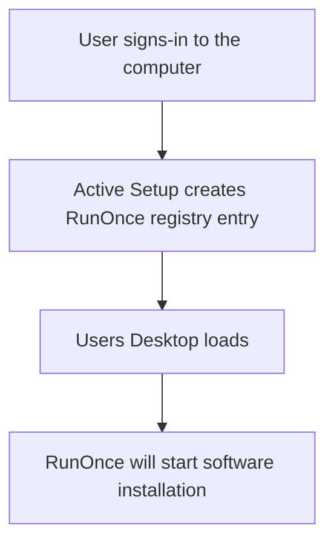

# Downloads and documentation
<b>Download links:</b> <br /> 
* [Spotify](https://www.spotify.com/de-en/download/windows/) <br />
* [Spotify Offline Installer](https://download.scdn.co/SpotifyFullSetup.exe)

### Software installation flow using Active Setup and RunOnce:

### Registry commands
```powershell
ni "HKLM:\SOFTWARE\Microsoft\Active Setup\Installed Components\InstallSpotify" | New-ItemProperty -Name "StubPath" -Value 'REG ADD "HKCU\Software\Microsoft\Windows\CurrentVersion\RunOnce" /v InstallSpotify /t REG_SZ /d "C:\SpotifyFullSetup.exe /Silent"'
```

# Related videos
### Windows registry
[Windows Registry: Run and RunOnce](https://youtu.be/zgFzCq5uEPw) <br />
[Windows Registry: Active Setup](https://youtu.be/HrVJ7wdvfmo) <br />
### Creating MSI file
[WiX toolset 4 CLI: Create Spotify MSI installation file](https://youtu.be/f8CWgrtAYwM)