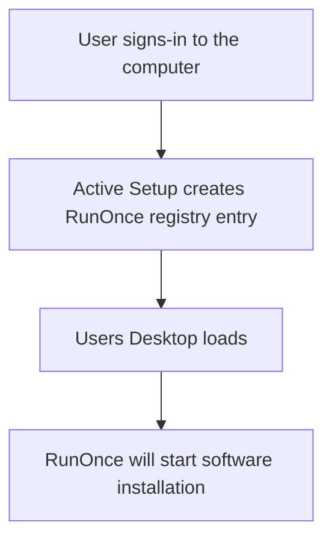

# Documentation and download
Download link: [Telegram](https://desktop.telegram.org/) <br />

### Silent install commands
```powershell
cmd /c tsetup-x64.4.10.2.exe /VERYSILENT /NORESTART
```
### Registry commands
```powershell
ni "HKLM:\SOFTWARE\Microsoft\Active Setup\Installed Components\InstallTelegram" | New-ItemProperty -Name "StubPath" -Value 'REG ADD "HKCU\Software\Microsoft\Windows\CurrentVersion\RunOnce" /v InstallTelegram /t REG_SZ /d "C:\tsetup-x64.4.10.2.exe /VERYSILENT /NORESTART"'
```

### Software installation flow using Active Setup and RunOnce:


# Related videos
###  PSEXEC
[Windows tools: Using PSEXEC for software deployment testing](https://youtu.be/9ywdTna_TLc) <br />
### Windows registry
[Windows Registry: Run and RunOnce](https://youtu.be/zgFzCq5uEPw) <br />
[Windows Registry: Active Setup](https://youtu.be/HrVJ7wdvfmo) <br />
### Creating MSI file
[WiX toolset 4 CLI:Create Telegram MSI installation file](https://youtu.be/wDiuEd88Ovc)